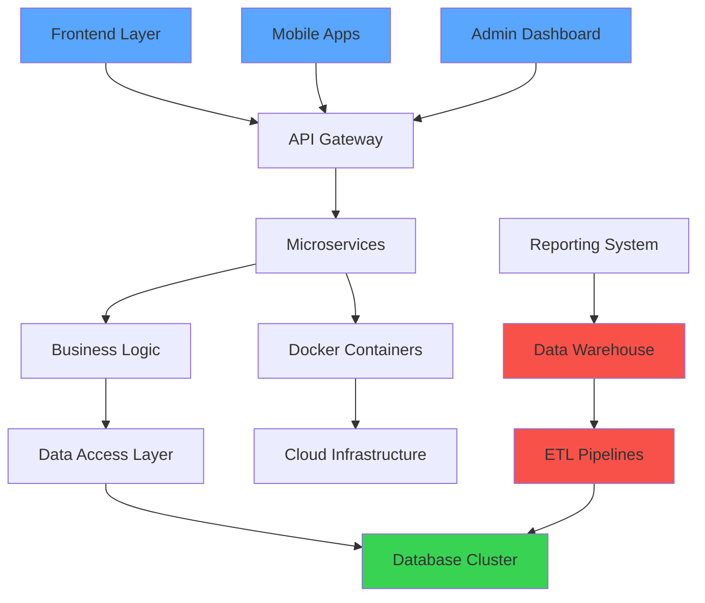

<div align="center">
  
# 💻 Baluku Wilton
### Senior Software Engineer | Enterprise Solutions Architect | Data Engineering Expert


</div>

---


### 👨‍💻 **PROFESSIONAL PROFILE**

```typescript
interface SeniorEngineer {
  name: string;
  title: string;
  experience: string;
  location: string;
  expertise: string[];
  currentProjects: string[];
  languages: string[];
}

const wiltonBaluku: SeniorEngineer = {
  name: "Baluku Wilton",
  title: "Senior Software Engineer",
  experience: "6+ years in enterprise development",
  location: "Kampala, Uganda 🇺🇬",
  expertise: [
    "Enterprise Architecture",
    "Data Warehouse Design",
    "Healthcare Information Systems", 
    "Government Digital Solutions",
    "Performance Optimization",
    "Team Leadership"
  ],
  currentProjects: [
    "eAfya Health Information System",
    "Ministry of Health Data Warehouse",
    "ETL Pipeline Architecture"
  ],
  languages: ["TypeScript", "JavaScript", "SQL", "Python"]
};
```

<br clear="right"/>

---

## 🏗️ **ENTERPRISE ARCHITECTURE & SOLUTIONS**

<table>
<tr>
<td width="50%">

### 🏥 **Government Healthcare Systems**
```sql
SELECT project_impact FROM healthcare_systems 
WHERE developer = 'Wilton Baluku'
AND scale = 'National Level';

-- Results:
-- ✅ 1000+ Health Centers Connected
-- ✅ 1M+ Patient Records Processed Daily  
-- ✅ Real-time Reporting Dashboard
-- ✅ 60% Performance Improvement
```

</td>
<td width="50%">

### 📊 **Data Engineering Excellence**
```python
# ETL Pipeline Architecture
class DataWarehouse:
    def __init__(self):
        self.tools = ["Pentaho", "PostgreSQL", "Express.js"]
        self.scale = "1M+ records/day"
        self.systems = ["eAfya Enhancement"]
        self.performance = "Sub-second queries"
    
    def transform_healthcare_data(self):
        return "Actionable Business Intelligence"
```

</td>
</tr>
</table>

---

## 💼 **TECHNOLOGY ECOSYSTEM**

<div align="center">

### **Full Stack Architecture**


### **Database & Data Engineering**


### **Mobile Development**


### **DevOps & Cloud Infrastructure**


</div>

---

## 🚀 **FEATURED ENTERPRISE PROJECTS**

<div align="center">
<table>
<tr>
<td align="center" width="33%">


**Healthcare Data Warehouse**
<br><sub>Ministry of Health Uganda</sub>
<br><br>
🔹 **Tech**: Pentaho + PostgreSQL + React<br>
🔹 **Scale**: 1M+ records daily<br>
🔹 **Impact**: National health reporting<br>
🔹 **Performance**: 60% improvement<br>
</td>
<td align="center" width="33%">


**eAfya Health System**
<br><sub>Full PERN Stack Development</sub>
<br><br>
🔹 **Coverage**: 1000+ health centers<br>
🔹 **Users**: Healthcare professionals<br>
🔹 **Features**: Patient management<br>
🔹 **Role**: Lead Full Stack Developer<br>
</td>
<td align="center" width="33%">


**Government Inventory**
<br><sub>Enterprise Supply Chain</sub>
<br><br>
🔹 **Live**: [inventory.health.go.ug](https://inventory.health.go.ug/)<br>
🔹 **Scope**: Medical supplies nationwide<br>
🔹 **Tech**: PERN + Docker<br>
🔹 **Features**: Real-time tracking<br>
</td>
</tr>
</table>
</div>

---

## 📈 **DEVELOPMENT ANALYTICS & PERFORMANCE**

<div align="center">


</div>

<div align="center">

</div>

<div align="center">

</div>

---

## 🏆 **PROFESSIONAL ACHIEVEMENTS**

<div align="center">
<table>
<tr>
<td align="center" width="25%">

<br><b>6+ Years</b>
<br><sub>Enterprise Development</sub>
</td>
<td align="center" width="25%">

<br><b>Government</b>
<br><sub>Healthcare Systems</sub>
</td>
<td align="center" width="25%">

<br><b>1M+ Records</b>
<br><sub>Daily Processing</sub>
</td>
<td align="center" width="25%">

<br><b>10+ Apps</b>
<br><sub>Published & Live</sub>
</td>
</tr>
</table>
</div>

---

## 🎯 **SYSTEM ARCHITECTURE EXPERTISE**



---

## 🤝 **PROFESSIONAL NETWORK & COLLABORATION**

<div align="center">

### 📧 **Contact for Enterprise Solutions**

<a href="mailto:balukuwilton@gmail.com">

</a>
<a href="https://linkedin.com/in/baluku-wilton">

</a>
<a href="https://wa.me/256759181816">

</a>
<a href="https://portifolio-gamma-one.vercel.app/">

</a>

### 👥 **Professional References**
**Mwesigwa Frank** - Government Projects Supervisor  
**Bukenya Kiiza Roland** - Senior Development Partner

---


**💡 "Architecting scalable solutions that transform industries and improve lives"**

 <b>Available for senior engineering roles and technical consulting</b> 

</div>
